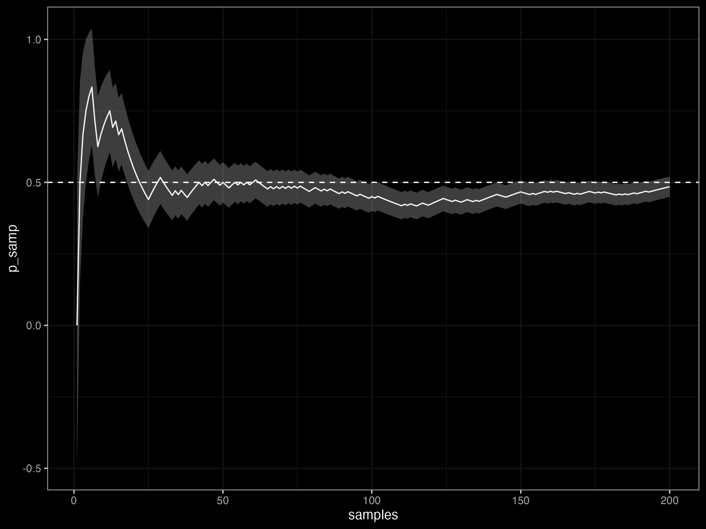
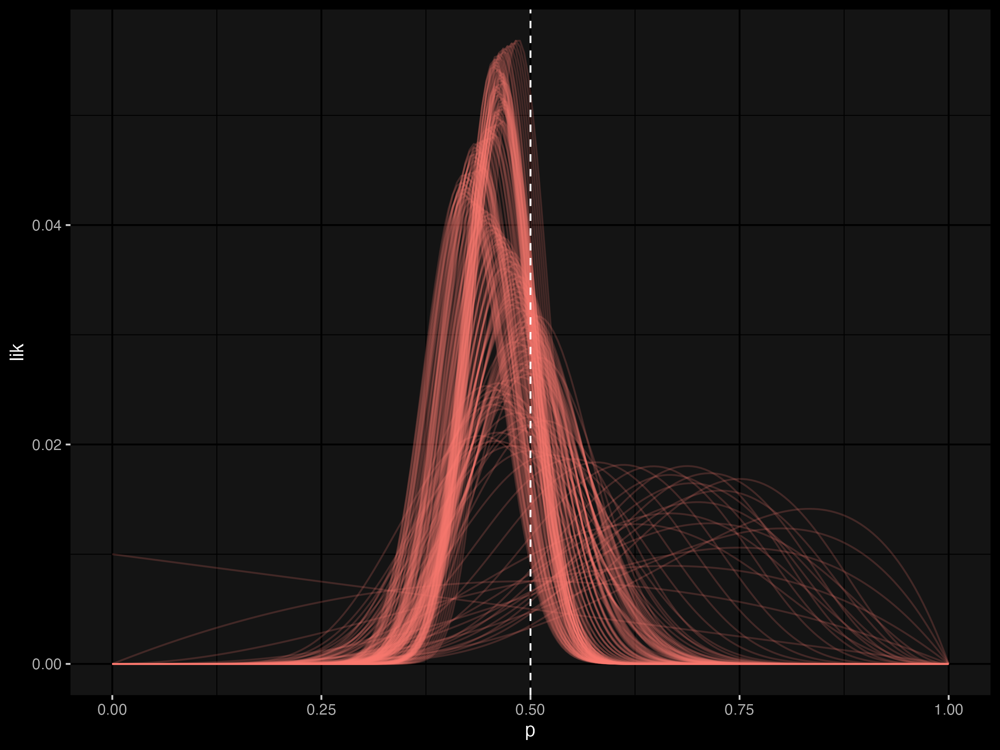
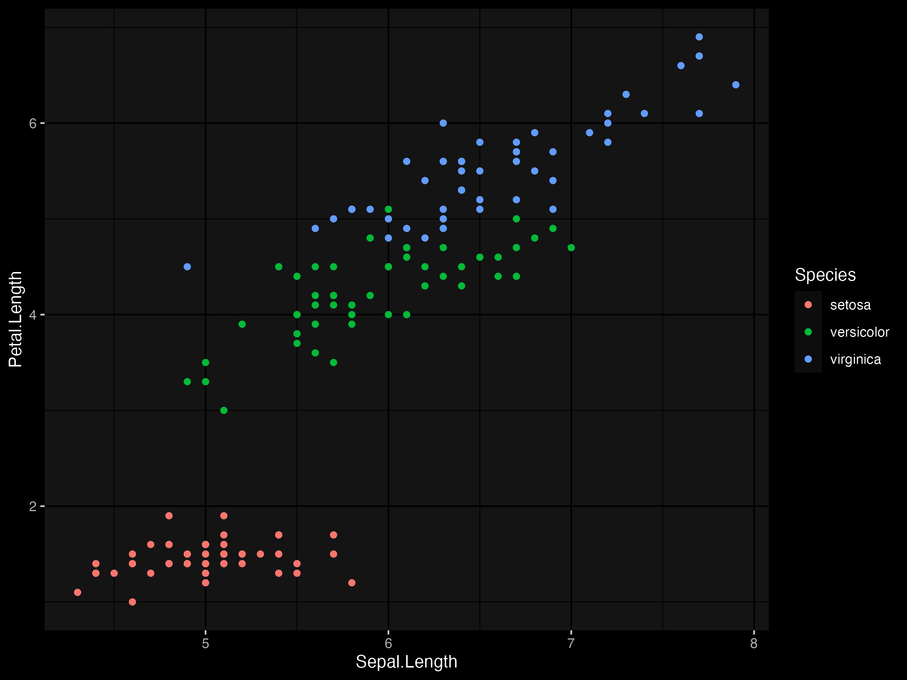
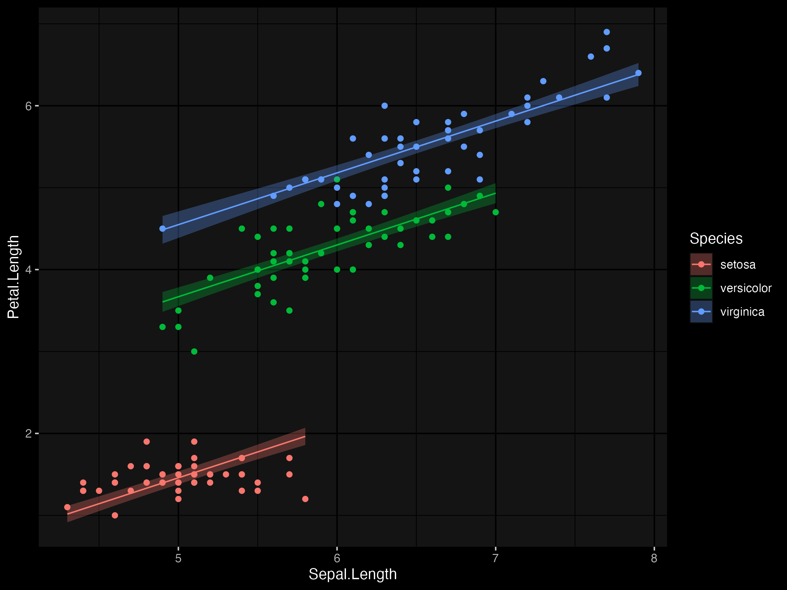

# Fitting simple Bayesian glm models with stan in R

We can visually show the difference in a Bayesian vs a frequentist approach to statistical inference using a simple coin toss example. 

Here, we flip a coin 200 times with $p=0.5$. 

```r
n <- 200
set.seed(1234)
outcomes <- cumsum(rbinom( n, 1, 0.5 ))
samples <- 1:n
p_hat = outcomes/samples
sd_p =  sqrt( 0.5 * (1 - 0.5) / samples )
```

Under a frequentist perspective, we might see that the more coin flips we make, the closer our sample estimate converges to the true proportion of 0.5 and the smaller the sd of our sample estimate $\hat{p}$.

```r
ggplot() + 
    geom_line(aes(samples, p_hat)) + 
    geom_ribbon(aes(samples, ymin=p_hat - sd_p, 
                             ymax=p_hat + sd_p), alpha=0.3) + 
    geom_hline(yintercept = 0.5, linetype=2) +
    dark_theme_bw()
```



But another way of seeing the coin is as probabilty density function where $p$ changes as we observe more data. The probability density starts wide, and gradually concentrates around the true value of $p$ as more coin tosses are observed. 

```r 
p <- seq(0, 1, length = n)
tibble(samples, outcomes) %>% 
    group_by(samples, outcomes) %>%
    expand_grid(p) %>%
    rowwise %>%
    mutate(log_lik = sum(log(dbinom(outcomes, samples, p)))) %>% 
    mutate(lik = exp(log_lik)) %>%
    group_by(samples) %>%
    mutate(lik = lik/sum(lik)) %>%
    ggplot() + 
        geom_line(aes(p, lik, group=samples, color='white'), alpha=0.2) + 
        guides(color = "none") + 
        geom_vline(xintercept = 0.5, linetype=2) +
        theme_bw() + 
        dark_theme_gray()
```



The other thing to notice, even in this example is the computational intensity of the Bayesian approach in which we estimated the probability density of for all hypothetical values of p. 

In practice, we do not need to estimate the probability density of all values of $p$, there are clever ways. This is where things like Gibbs sampling and Hamiltonian Monte Carlo come into play. Have a read of [Statistical Rethinking by Richard McElreath](https://xcelab.net/rm/statistical-rethinking/) for a great intro. 

# Fitting a glm with `glm`

Here we use the `iris` data set bundled with R.

```r
data(iris)
d <- as.data.frame(iris)

p <- ggplot(d, aes(Sepal.Length, Petal.Length, color = Species)) +
    geom_point() +
    dark_theme_grey()
p
```


First, we start with an `lm` but we use `glm` with `family=gaussian` to make to approach more general other general linear models. I find it is always handy to know multiple ways to fit a model.

```r
m1 <- glm(Petal.Length ~ Sepal.Length + Species,
    family = gaussian,
    data = d
)

m1_pred <- predict(m1, se.fit = TRUE) %>%
    as_tibble() %>%
    mutate(
        lower = fit - 1.96 * se.fit,
        upper = fit + 1.96 * se.fit
    )
p +
    geom_line(aes(y = m1_pred$fit)) +
    geom_ribbon(aes(ymin = m1_pred$lower, ymax = m1_pred$upper, fill = Species),
        alpha = 0.3,
        color = NA
    )
```



```r
> summary(m1)

Call:
glm(formula = Petal.Length ~ Sepal.Length + Species, family = gaussian, 
    data = d)

Deviance Residuals: 
     Min        1Q    Median        3Q       Max  
-0.76390  -0.17875   0.00716   0.17461   0.79954  

Coefficients:
                  Estimate Std. Error t value Pr(>|t|)    
(Intercept)       -1.70234    0.23013  -7.397 1.01e-11 ***
Sepal.Length       0.63211    0.04527  13.962  < 2e-16 ***
Speciesversicolor  2.21014    0.07047  31.362  < 2e-16 ***
Speciesvirginica   3.09000    0.09123  33.870  < 2e-16 ***
---
Signif. codes:  0 ‘***’ 0.001 ‘**’ 0.01 ‘*’ 0.05 ‘.’ 0.1 ‘ ’ 1

(Dispersion parameter for gaussian family taken to be 0.07984347)

    Null deviance: 464.325  on 149  degrees of freedom
Residual deviance:  11.657  on 146  degrees of freedom
AIC: 52.474

Number of Fisher Scoring iterations: 2
```

# Fitting a glm with `rstan`

One of the downsides of using `rstan` is the manual data preparation required for model fitting. While there are handy packages like `rstanarm` which help to reduce this overhead, it is not too difficult to start from scratch if we use a couple of tricks.

Using the `model.matrix` function is a handy way to build a covariate matrix which will save us having to the update the model defined in `.stan` and data passed to the `stan()` each time we tweak the model. 

```r
> model.matrix(m1)
    (Intercept) Sepal.Length Speciesversicolor Speciesvirginica
1             1          5.1                 0                0
2             1          4.9                 0                0
3             1          4.7                 0                0
4             1          4.6                 0                0
5             1          5.0                 0                0
//...
146           1          6.7                 0                1
147           1          6.3                 0                1
148           1          6.5                 0                1
149           1          6.2                 0                1
150           1          5.9                 0                1
```

Another handy tool is the `lookup()` function from `stan`, which can help find a suitable probability density function in `stan`. 

```r
> lookup(dnorm)
          StanFunction
374 normal_id_glm_lpmf
375 normal_id_glm_lpmf
376      normal_id_glm
379        normal_lpdf
380             normal
                                                       Arguments ReturnType
374   (vector y , matrix x, real alpha, vector beta, real sigma)       real
375 (vector y , matrix x, vector alpha, vector beta, real sigma)       real
376                                                            ~       real
379                            (reals y , reals mu, reals sigma)       real
380                                                            ~       real
```

Here we select the `normal` function and construct our `.stan` file as follows:

```
//lm_model.stan

data {
  int <lower = 0> N; 
  vector [N] y ; 
  int<lower=0> K;   
  matrix[N, K] X;  
}

parameters {
  vector [K] beta;
  real <lower=0> sigma;
}

model {
    y ~ normal_lpdf(beta*X, sigma);
}

```

We then construct a list of the data that matches the structure defined in the stan file and fit the stan model.

```r
stan_data <- list(
    N = nrow(mat),
    y = d$Petal.Length,
    K = ncol(mat),
    X = mat
)

m2 <- stan(
    file = "lm_model.stan",
    data = stan_data,
    warmup = 500,
    iter = 3000,
    chains = 4,
    cores = 4,
    thin = 1,
    seed = 123
)
```
If we check the model parameter estimates, they are very close to those estimated above by `lm`.

```r
> print(m2, probs = c(0.025, 0.975))
Inference for Stan model: lm_model.
4 chains, each with iter=3000; warmup=500; thin=1; 
post-warmup draws per chain=2500, total post-warmup draws=10000.

          mean se_mean   sd   2.5%  97.5% n_eff Rhat
beta[1]  -1.71    0.00 0.23  -2.16  -1.26  2765    1
beta[2]   0.63    0.00 0.05   0.54   0.72  2564    1
beta[3]   2.21    0.00 0.07   2.07   2.35  3282    1
beta[4]   3.09    0.00 0.09   2.90   3.27  2956    1
sigma     0.28    0.00 0.02   0.25   0.32  5616    1
lp__    -25.02    0.03 1.54 -28.81 -22.93  3724    1

Samples were drawn using NUTS(diag_e) at Fri Aug 12 10:02:49 2022.
For each parameter, n_eff is a crude measure of effective sample size,
and Rhat is the potential scale reduction factor on split chains (at 
convergence, Rhat=1).
```

Constructing the prediction inverval is a little different to above. Because we don't have direct estimates to the uncertainty in parameter estimates, it must be accessed via sampling the posterior cistribution. So we take a bunch of samples and calculate the appropriate quantiles of interest (e.g. 95% credible intervals). 

```r
e <- rstan::extract(m2)
str(e)

dim(e$beta)
dim(mat)
pred_post <- e$beta %*% t(mat)
pred <- apply(pred_post, 2, function(x) quantile(x, c(0.025, 0.5, 0.975)))
m2_pred <- d %>%
    transmute(
        lower = pred[1, ],
        mu    = pred[2, ],
        upper = pred[3, ]
    )
p +
    geom_line(aes(y = m2_pred$mu)) +
    geom_ribbon(aes(ymin = m2_pred$lower, ymax = m2_pred$upper, fill = Species),
        alpha = 0.3,
        color = NA
    )
```


While this sounds like more work, in practice it is a flexible approach that can allow us to very quickly make inference on any derived or compound parameters. 

## Logistic regression (binoimal model)


